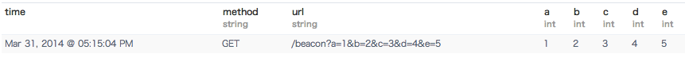

How to divide url query parameters.
================

## Plugin

* [fluent-plugin-extract_query_params](https://github.com/kentaro/fluent-plugin-extract_query_params)

## How to use

1. Install plugin.  
`$ sudo /usr/lib/fluent/ruby/bin/fluent-gem install fluent-plugin-extract_query_params`

2. Add config into td-agent.conf  
`$ sudo vi /etc/td-agent/td-agent.conf` (See td-agent.conf)

3. Restart td-agent  
`$ sudo /etc/init.d/td-agent restart`

4. Write log into log file that td-agent is monitoring.
`$ echo '[31/Mar/2014:08:15:04 +0000] "GET /beacon?a=1&b=2&c=3&d=4&e=5"' | sudo tee -a /var/log/access.log`

5. The log are sent to Treasure Data.
